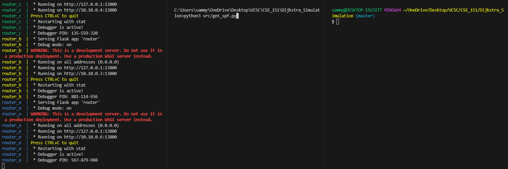
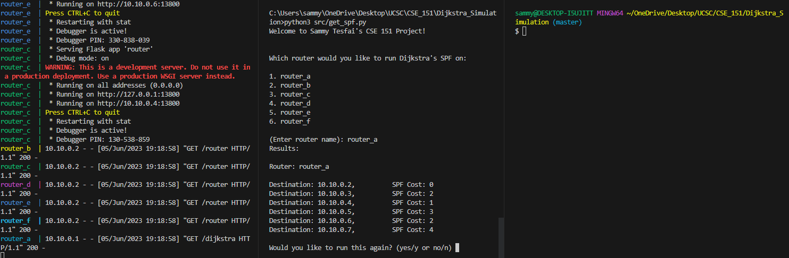
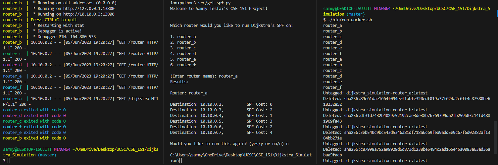
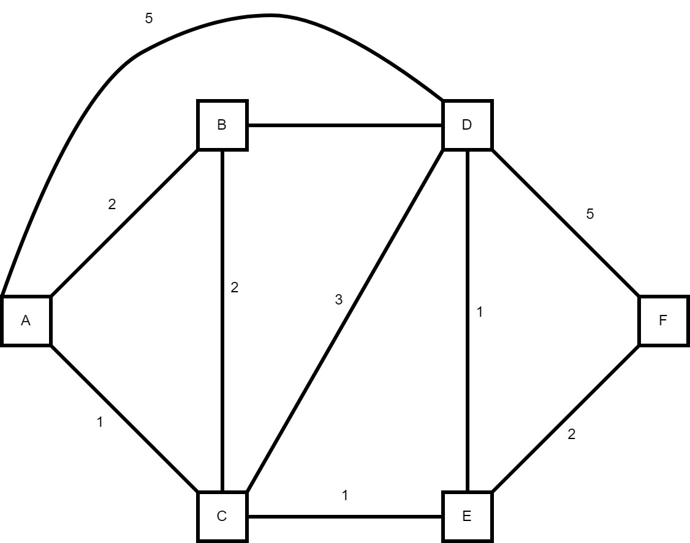

# Dijkstra Simulation

## Description
This project simulates the use of Dijkstra's SPF algorithm by using Flask nodes that communicate with one another within a docker network. Upon client requests each node computes its independent shortest path to all other nodes within routing domain. Settings for how the network is structured is defined within the compose file and can be adjust from there. To use use this project a user will need to have git installed in order to clone this repo, docker to create images and containers for each node to communicate, Python Flask and Request API will be installed by the the docker file provided. Please refer to the example below on how to execute this project. 

## Modules
- get_spf.py
    - Parses the compose file to identify the current nodes and ports being used and creates a mapping from name to port. Also interfaces with user to perform SPF on a specific router. Formulates curl request using the name provided by user and outputs calculated SPF for all other routers in domain.  
- router.py
    - REST API (Flask) that responds to client requests in order to calculate and perform Dijkstras SPF algorithm and responds to the client with the cost to all other nodes in routing domain with the cheapest cost to the destination.
- node.py
    - Class module to hold specific router information for all routers in the the domain. Holds SPF information, local link cost, and local ip information. 
- misc.py
    Miscellaneous module that performs broadcast communication with all other nodes in domain and helper function to print spf output in a more readable manner.

## Example
- Start the docker daemon
- Once docker daemon is running in background enter [`docker compose up`] in a terminal that is currently in the top directory of this project. This will create images and containers for all the routers.

- Once all routers are active and waiting for incoming request on a seperate terminal we will call our client module with [`src/python3 get_spf.py`] (**This module requires python3 to operate**)

- Once executed the program will prompt the user to enter the name of the router to perform SPF on. Refer to the compose file for current router names and enter the name exactly as it is this file. The program will then output the cheapest cost to all other nodes relative to the node mentioned. The program will then prompt the user to either continue the program and get SPf output for another node or terminate the program.

- A bash script is also provided to clean up currently running docker containers and images. Simply call [`./bin/run_docker.sh`] at the top level directory.

## Topology

